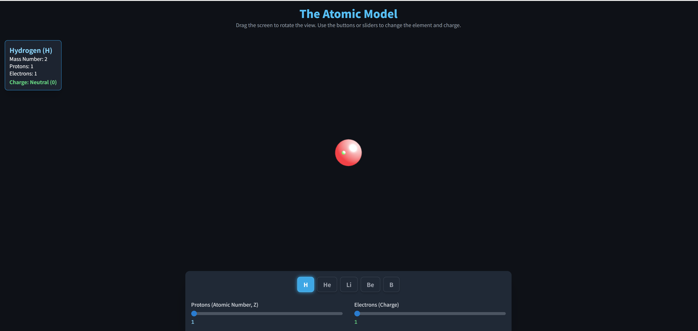

# ⚛️ Interactive 3D Atom Simulator

This project is a fully self-contained, single-file web application that visualizes the **Bohr atomic model** in interactive 3D using **HTML**, **Tailwind CSS**, and **Three.js**.  
Users can explore atomic structure by selecting elements, adjusting proton/electron counts, and observing how changes affect the atom’s charge state.

---

## 🖼️ Screenshot



---

## ✨ Features

### 🔭 3D Visualization  
- Fully interactive 3D atom model  
- Realistic orbits with animated electrons  
- Rotate the scene via drag/swipe gestures  

### 🔬 Element Selection  
- Quick-select buttons for: **H, He, Li, Be, B**  
- Automatically loads the neutral (Z = electrons) structure  

### 🎚️ Customization Sliders  
- **Protons (Atomic Number Z):** 1–18 (Hydrogen → Argon)  
- **Electrons:** Add/remove to form ions  
- Instantly updates the atom’s charge state  

### 📊 Real-time Information Panel  
Displays:  
- Element name  
- Atomic number (Z)  
- Electron count  
- Ion charge (cation/anion/neutral)  

### 🌀 Interactive Rotation  
- Rotate the atom freely in 3D space  
- Works on desktop and mobile touchscreen devices  

---

## 🚀 How to Use

1. **Open the File**  
   Simply open `index.html` in any modern web browser.  
   No server or installation needed.

2. **Select an Element**  
   Click any of the quick-access buttons (**H**, **He**, **Li**, **Be**, **B**) to load neutral atoms.

3. **Customize the Atom**  
   - Adjust **Protons (Z)** to switch elements (up to Argon).  
   - Adjust **Electrons** to create ions and observe charge changes.

4. **Interact with the 3D Model**  
   - Click + drag (desktop) or swipe (mobile) to rotate the atom  
   - View electron shells from any angle  

---

## 🛠️ Technology Stack

- **HTML5** – Structural layout  
- **Tailwind CSS** – Clean and responsive UI styling  
- **Three.js** – 3D graphics and orbiting electron animation  

---

## 📂 Project Structure

```
/
├── index.html   # Self-contained application
├── Screenshot.png        # Preview image for README
└── README.md             # Documentation
```

---

## 📄 License

This project is open source under the **MIT License**.  
Created for educational and visualization purposes.

